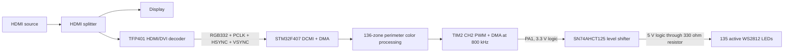

# STM32F407 HDMI Ambient Lighting

Real-time ambient TV lighting built around an STM32F407 Discovery board. The
firmware captures an 8-bit RGB332 video stream from a TFP401 HDMI/DVI decoder,
calculates colors for the display perimeter, and drives a WS2812 LED strip
through timer-controlled PWM and DMA.

The project is an embedded-systems prototype focused on peripheral integration,
deterministic signal generation, real-time image sampling, and hardware-level
debugging.

## System Overview



## Highlights

- Captures a `1280 x 720` parallel video stream using the STM32F407 DCMI
  peripheral and DMA.
- Samples narrow crops around the display perimeter and maintains 136 logical
  color zones.
- Maps the logical zones to 135 physical LEDs around the display.
- Produces the WS2812 800 kHz waveform with TIM2 Channel 2 and DMA.
- Uses an SN74AHCT125 to convert the STM32's 3.3 V data signal to a reliable
  5 V WS2812 data signal.
- Applies weighted RGB averaging, adaptive temporal smoothing, missed-zone
  handling, and scene-change response logic.
- Includes runtime instrumentation used to isolate capture, synchronization,
  processing, and output-path faults.

## Hardware

| Component | Role |
|---|---|
| STM32F407 Discovery | Video capture, color processing, and LED control |
| Adafruit TFP401 HDMI/DVI decoder breakout | Converts HDMI/DVI video to parallel RGB and synchronization signals |
| HDMI splitter | Sends the source to both the display and TFP401 decoder |
| WS2812 LED strip | Individually addressable ambient-light output |
| SN74AHCT125N | 3.3 V-to-5 V non-inverting logic-level conversion |
| 330 ohm resistor | Series resistor between the level-shifter output and WS2812 DIN |
| 100 nF ceramic capacitor | Local decoupling directly across SN74AHCT125 VCC and GND |
| 100 uF electrolytic capacitor | Bulk capacitance across the 5 V LED supply near the input electronics |
| Regulated 5 V power supply | Powers the LED strip and SN74AHCT125 |

See [docs/hardware_wiring.md](docs/hardware_wiring.md) for the complete wiring
diagram, level-shifter pinout, capacitor placement, and power notes.

See [docs/tfp401_pin_map.md](docs/tfp401_pin_map.md) for the TFP401-to-STM32
DCMI wiring.

## Firmware Pipeline

1. The TFP401 presents RGB332 pixels plus pixel-clock, HSYNC, and VSYNC signals.
2. DCMI and DMA capture narrow regions along the display perimeter.
3. The capture module assigns sampled pixels to individual logical zones and
   calculates weighted RGB values.
4. Temporal filtering reduces visible jitter while retaining scene-change
   responsiveness.
5. The WS2812 module maps logical zones to the physical strip layout.
6. TIM2 Channel 2 and DMA transmit the GRB waveform through PA1 and the
   SN74AHCT125 level shifter.

## Physical LED Layout

The installed perimeter uses 135 active LEDs. The processing pipeline maintains
136 logical input zones because the left side is resampled from 25 input zones
to 24 physical LEDs.

| Edge | Physical LED count | Direction |
|---|---:|---|
| Left | 24 | Bottom to top |
| Top | 43 | Left to right |
| Right | 25 | Top to bottom |
| Bottom | 43 | Right to left |

## Important Timing

- System clock: `168 MHz`
- TIM2 kernel clock: `84 MHz`
- WS2812 slot rate: `800 kHz`
- TIM2 auto-reload value: `104`
- Logical 0 compare value: `34`
- Logical 1 compare value: `67`
- WS2812 reset slots: `48` (`60 us` low at 800 kHz)

## Building and Flashing

1. Install STM32CubeIDE and the STM32CubeF4 firmware package.
2. Clone this repository.
3. Import the directory as an existing STM32CubeIDE project.
4. Open `led flash.ioc` to inspect or regenerate the CubeMX configuration.
5. Build and flash the project through the Discovery board's ST-LINK interface.

Before powering the LED strip, verify the wiring in
[docs/hardware_wiring.md](docs/hardware_wiring.md), especially the shared ground
and external 5 V LED supply.

## Repository Layout

```text
Inc/                  Application and generated headers
Src/                  Application and generated source files
Startup/              STM32 startup assembly
Drivers/              STM32 HAL and CMSIS dependencies
docs/                 Hardware and signal documentation
led flash.ioc         STM32CubeMX project configuration
```

## Current Status

The complete capture-to-light pipeline is operational. The project remains
under active development, with current work focused on improving side-edge
capture scheduling, reducing response latency, and simplifying diagnostic
instrumentation.

## Engineering Lessons

This project required debugging across the complete hardware/software boundary,
including:

- DCMI synchronization and crop geometry
- HSYNC wiring and signal continuity
- DMA transfer width and peripheral register alignment
- timer-clock and WS2812 pulse-width calculations
- 3.3 V-to-5 V logic-level compatibility
- LED power integrity and decoupling
- latency and memory tradeoffs on a resource-constrained MCU

## Safety and Power

The STM32 board must not power the full LED strip. Use a suitably rated external
5 V supply for the strip, connect all grounds together, and keep initial
brightness low while validating the system.
